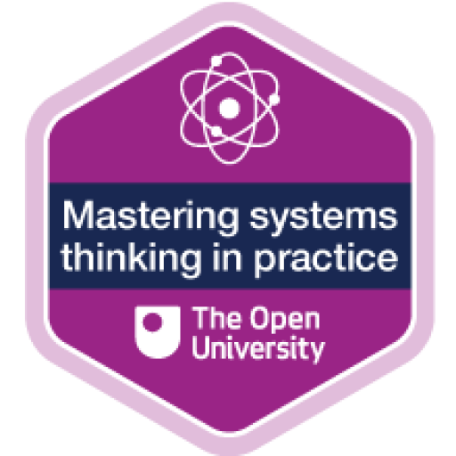
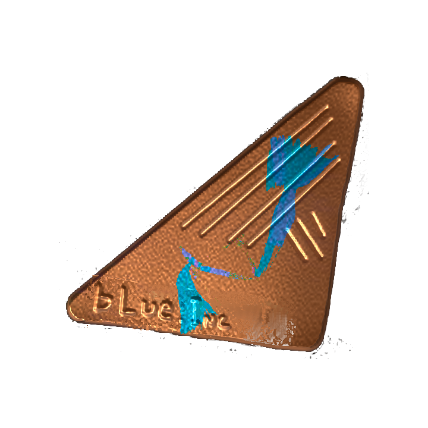
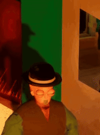

<!---->

  
  

  

  
  <!--
  [STEAM GAMES](#LIBRA) | [TIMELINE](#timeline)
  -->

I enjoy developing AI agents to automate my workflows for efficiency.

Training and fine-tuning agents is my speciality.

If you're an SME located in the UK, TechLocal has launched a £7.6m fund to help people like you recruit and retain tech talent like me.

<a href="https://github.com/ja179053/ollama">Check out a basic Ollama project here!</a>
  

<table>
  <tr style="vertical-align: top;" align="center">
    <td width="65%">
      
       
      
       
      
 
      <h2>🚀 History: AI & Game Architecture</h2>
      

      My AI transition didn't feel like a transition. I studied Unity's ML agents while at university and made chat bots on Discord and Twitch for fun. My main interest has been AI Systems for most of my life. With the rise of LLMs I still prefer fine-tuning checkpoints for local use, giving modern machines a boost for their tailored needs. Whether that is remembering where files are, requiring check-ins, or daily reports, automated LLMs are empowering small work forces to handle many times the workload. The best part of AI is it challenges humans to accomplish more than they believed humanly possible.
      

      

      After my junior year, I decided to explore tech in a way that would be most beneficial to my health. Building apps in <b>Xamarin</b>. Cutting my bad habits and studied work hierarchies, becoming qualified in <b>Ethical Hacking, Food Hygeine</b> and <b>Mastering systems thinking in practice</b>. I crafted my own development team with minimal storming and maximised performance. And in the end, I pushed a playable build of my once student game to market.
      

      <table align="center">
  <tr>
    <th colspan="1" align="center"> 
    Mastering Systems Thinking In Practice 
    </th>
    <th colspan="2" align="center"> 
    Ethical Hacking</th>
    </th>
  </tr>
  <tr align="center">
    <td>
      
    </td>
    <td>
      
    </td>
    <td>
      
    </td>
  </tr>
</table>
      

      After graduating, my role was to develop new and existing software in order to satisfy growing company requirements. I introduced Scrum, pushed for short and effective stand-ups, and developed my knowledge for neighbouring languages 
      <b>
      CSS, HTML, </b>
      and 
      <b>BASIC
      </b>
      within the Microsoft Azure environment.
      

      
I started out learning to develop video games. My course focused on developing within small teams to deliver big impacts, through the AGILE workflow. I learnt to use 
      <b>Unity, Google Cardboard (VR)</b>
      and 
      <b>Unreal Engine</b>
      to develop video games for 
      <b>Windows, Mac, Linux</b>
      and 
      <b>and HTML5.</b>
      

       
    </td>    
    <td width="35%">
      <h3>📂 Timeline</h3>
      <ul>
        <li><b>2025-2026</b>   🎮 <i>Steam Early Access Release</i>  LIBRA:THERE ARE TWO</li>
        
        <li><b>2024-2025</b>   🤖 <i>AI Research/Ethical hacker</i>   Built Agentic Python Pipelines</li>
         
        <i>Python, Batch, HTML, BASIC, Java</i>
         
        <i>.NET/VMs</i>
        <li><b>2020-2024</b>   🏗️ <i>Independent Research & Development Phase</i>  </li>        
        <li><b>2018-2020</b>   🏗️ <i>App Developer</i>  </li>
        <i>C#, javascript, CSS, HTML, Java</i>
        <i>Xamarin/.NET MAUI/Azure/AWS/.NET/Cloud Computing</i>
        <li><b>2017-2018</b>   🏗️ <i>Associate Software Programmer</i>  </li>
        
         
        <i>C#, javascript, CSS, HTML, BASIC</i>
         
        <i>.NET/VMs</i>
        <li><b>2014-2017</b>   🎓 <i>Education</i>   BA (Hons) Digital Games: Programming</li>
        

          
          <i>C#, C++, Git</i>
           
          <i>Unity, Unreal, Blender, ML Agents</i>
        

      </ul>
    </td>
  </tr>
</table>

## LIBRA
  <a href="https://store.steampowered.com/app/3381290/LIBRA_There_Are_Two/">

<table border="0">
  <tr>
    <td width="30%"></td>
    <td width="40%" align="center" style="padding: 0 20px;">
        A single player story-driven RPG where you explore and upgrade a mysterious world, to escape.
    </td>
    
    <td width="30%"></td>
  </tr>
</table>

      

        Yesterday felt normal. Today, the balance is gone. In <b>LIBRA: There Are Two</b>, a routine day unravels into a creeping horror where everybody is simply gone. You’re not just trying to escape; you’re exploring a world that stopped making sense, fighting for every inch of ground, and desperately trying to restore what once was.
      

</a>
---

  
Interested in the architecture behind the systems? Want to know more about game development? The <b>LIBRA</b> repository is being fully documented, featuring clean-code practices, system diagrams, and modular logic. Click here for all the latest behind the scenes updates!

  
  

 